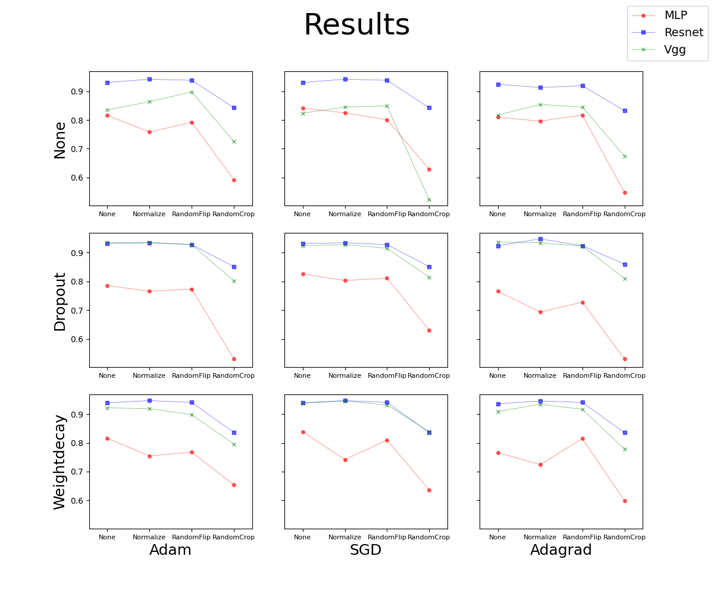

# Seedings Classification
This is a work on seedings classification, you can find detials about this task on [Kaggle](https://www.kaggle.com/competitions/plant-seedlings-classification). I have implemented several traditional machine learning based classification methods and deep learning based classification methods and compared the performance bewteen them.

## Usage
Use `sh train.sh` to run all cases. Or you can follow help message of `main.py` to get the result of a certain situation.

## Traditional Methods
### Features
I have implemented **Hog feature** and **SIFT feature**. For Hog feature, I just simply use the function in skimage and then concatenate the feature for every images as a ndarray. For SIFT feature, I set the max number of key points as 200. For those image which the number of key points is less than 200, I resize their feature vectors to the same size.

### Classification
I have implemented the **SVM**, **Kernel SVM** and **Kmeans clustering**, using the function in sklearn.

## Deeplearning Methods
### Networks
I have implemented three different networks--**Resnet18**, **Vgg11bn** and **MLP**. For Resnet18 and Vgg11bn, I use the model in torchvision and change the output_features to fit this task. And for MLP, because of the dims of image vector is too large, I use several conv2d layer to embedding the feature vectors and use several linear layer.

### Optimizer
I use three different optimizers--**Adam**, **SGD**, **Adagrad** and compare their effect. For different optimizers, the learning rate has a little different.

### Data Augmentation
I have implemented three different data augmentations--**Normalize**, **Randomfilp**, **Randomcrop** and compare their effect.

### Regularization
I have implemented three different regularization methods--**Dropout**, **Weight Decay**

## Experiment and Result
### Traditional Methods
For the traditional method, the final result is poorer due to the lack of parameter adjustment, which may also be related to the traditional method itself. The result is showing in the following table.
|acc|HOG|SIFT|
|:-:|:-:|:-:|
|SVM|0.336|0.136|
|Kernel SVM|0.207|0.144|
|Kmeans clustering|0.161|0.116|
### Deeplearning Methods
For the traditional method, the final result is much better, Resnet is better than VGG and VGG is better than simple MLP in most cases. According to the result and training process, I think Adam is better than SGD and Adagrad, SGD is more sensitive to learning rates, and Adagrad is difficut to train in the late stages of training. Dropout and Weightdecay can improve the result, but the effect is not obvious. Data augmentation can improve the performance for more complex network structures, but can lead to a decrease in accuracy for simple data structures. The result is showing in the following figure.
